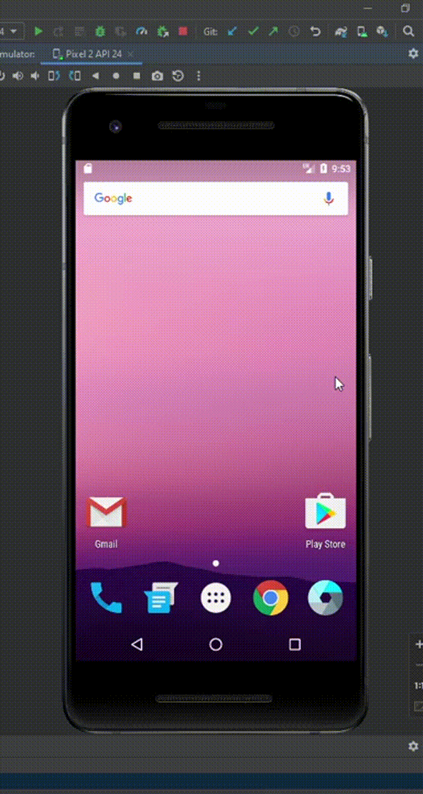

# 

# ProgramacaoIV-VisualStudio

Trabalho da disciplina Programação IV cursada na UEMG em 2022.

O projeto consiste em um aplicativo de conversão de moedas.

------

### :rocket: Funcionalidades:

- Cotação de Dólar para Real
- Cotação de Euro para Real
- Cotação de Libra para Real

------

### :rocket: Recursos utilizados:

- Foi utilizada a linguagem Kotlin no ambiente do Android Studio
- Para gerar a cotação em tempo real foi consumido dados da API Exchange Rates ( https://exchange-rates.abstractapi.com )

------

### :rocket: Preview:

</img>

------

###  :rocket: Contato:

Alguma dúvida, crítica ou elogio? Não hesite em entrar em contato. Será um prazer conversar a respeito!

 [Whatsapp](https://api.whatsapp.com/send?phone=5535997438652) |  [E-mail](mailto:thales.o.nunes@gmail.com)